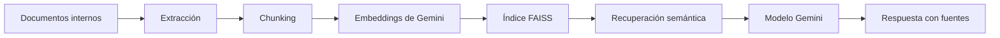
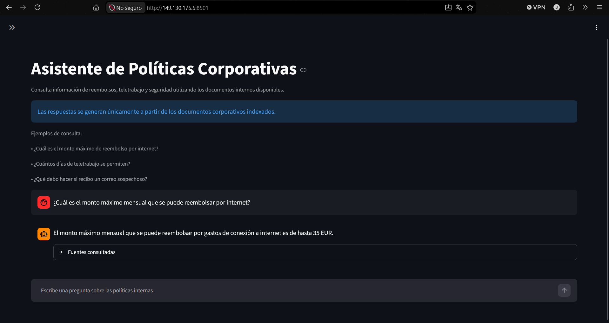
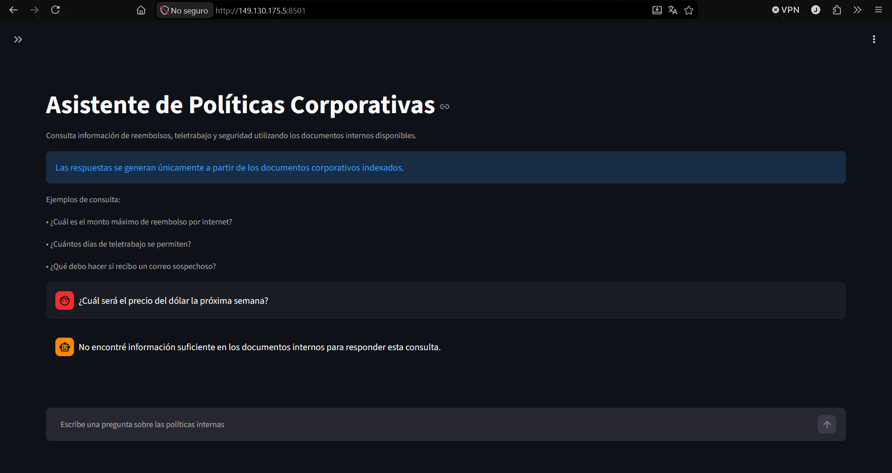

# Challenge Alura Agente

Aplicación web de consulta de políticas internas mediante recuperación aumentada por generación (RAG). Carga documentos del directorio configurado, recupera los fragmentos relevantes y presenta una respuesta generada a partir de ese contexto junto con sus fuentes.

## Problema que resuelve

Las políticas internas suelen estar repartidas entre varios documentos y formatos. La aplicación proporciona una interfaz de Streamlit para consultar ese corpus en lenguaje natural, sin responder con información cuando la recuperación no ofrece evidencia suficiente.

## Funcionalidades principales

- Carga recursiva de documentos admitidos y extracción de texto por unidad documental (por ejemplo, página, hoja o diapositiva cuando aplica).
- Fragmentación determinista con metadatos de origen, posición y tipo de archivo.
- Generación configurable de embeddings de Gemini e índice vectorial local FAISS con similitud coseno.
- Persistencia segura del índice en `index.faiss`, `documents.json` y `manifest.json`; no se utiliza `pickle`.
- Recuperación semántica con cantidad de resultados y umbral configurables.
- Construcción de mensajes RAG que tratan el contexto recuperado como datos externos, no como instrucciones.
- Respuesta con referencias de fuentes o mensaje de fallback cuando no hay información suficiente en el corpus.
- Interfaz Streamlit con historial de conversación y una acción explícita para reconstruir el índice.

## Arquitectura RAG



Durante la consulta, los resultados recuperados se delimitan antes de construir los mensajes. Las instrucciones del sistema indican que el contenido documental es una fuente de datos no confiable: no puede cambiar las reglas ni aportar instrucciones para el modelo.

## Formatos de documentos soportados

La capa de ingesta admite los siguientes formatos:

| Formato | Extensiones |
| --- | --- |
| PDF | `.pdf` |
| Microsoft Word | `.docx` |
| Microsoft Excel | `.xlsx` |
| Microsoft PowerPoint | `.pptx` |
| Markdown | `.md` |
| CSV | `.csv` |
| JSON | `.json` |
| HTML | `.html`, `.htm` |

Los archivos se cargan de forma recursiva desde el directorio indicado por `DOCUMENTS_DIR`. Los documentos o unidades sin contenido textual útil se omiten.

## Tecnologías utilizadas

- Python 3.13 en la imagen de contenedor.
- Streamlit para la interfaz web.
- LangChain Core, `langchain-google-genai` y `langchain-text-splitters` para documentos, mensajes, modelos Gemini y fragmentación.
- Gemini para embeddings y generación conversacional, con los modelos configurados mediante variables de entorno.
- `faiss-cpu` y NumPy para el índice vectorial local y la similitud coseno.
- PyMuPDF, `python-docx`, `openpyxl`, `python-pptx` y Beautiful Soup para extraer los formatos admitidos.
- `python-dotenv` para cargar la configuración local desde el punto de entrada de la aplicación.
- Docker y Docker Compose para la ejecución contenida.

Las dependencias de desarrollo incluyen `pytest` en `requirements-dev.txt`.

## Estructura principal

```text
.
├── app.py                  # Interfaz Streamlit
├── src/
│   ├── app_runtime.py      # Configuración, recursos e índice de la aplicación
│   ├── ingestion/          # Carga y extracción de documentos
│   └── rag/                # Chunking, embeddings, FAISS, contexto, prompts y servicio RAG
├── documents/              # Corpus documental de entrada
├── data/vector_store/      # Índice local persistido (generado; no se versiona)
├── tests/                  # Pruebas unitarias e integradas
├── Dockerfile
├── compose.yaml
└── deploy/oci/README.md    # Operación del despliegue con Docker Compose
```

## Configuración local

Los siguientes pasos usan PowerShell en Windows.

1. Crea y activa el entorno virtual:

   ```powershell
   python -m venv .venv
   .\.venv\Scripts\Activate.ps1
   ```

2. Instala las dependencias de desarrollo:

   ```powershell
   python -m pip install -r requirements-dev.txt
   ```

3. Crea la configuración local a partir del ejemplo:

   ```powershell
   Copy-Item .env.example .env
   ```

4. Completa `GOOGLE_API_KEY` y, si hace falta, ajusta las variables no secretas de `.env`. Los valores de ejemplo incluyen el directorio de documentos, el modelo de chat, el modelo de embeddings, el tamaño y solapamiento de fragmentos, y los parámetros de recuperación.

5. Inicia la interfaz:

   ```powershell
   python -m streamlit run app.py
   ```

En el primer inicio, o cuando se solicite una reconstrucción desde la interfaz, se genera el índice local en el directorio configurado por `VECTOR_STORE_DIR`.

## Ejecución con Docker Compose

Con Docker Engine y el plugin Docker Compose instalados, crea primero el archivo `.env` local como se indicó arriba. Después, desde la raíz del repositorio:

```bash
docker compose up -d --build
docker compose ps
```

Para comprobar el estado de la aplicación:

```bash
curl --fail http://localhost:8501/_stcore/health
```

Otros comandos útiles:

```bash
docker compose logs -f app
docker compose restart app
docker compose down
```

`docker compose down` conserva el volumen del índice. En cambio, `docker compose down -v` elimina ese volumen y, por tanto, el índice persistido.

## Despliegue en OCI Compute

El despliegue objetivo usa una instancia Oracle Linux 9 con Docker Engine y el plugin Docker Compose. La guía operativa ampliada está en [deploy/oci/README.md](deploy/oci/README.md).

- El contenedor ejecuta la aplicación como `appuser` con UID fijo `10001`, no como `root`.
- El healthcheck consulta `/_stcore/health` en el puerto `8501`.
- Docker Compose mantiene el índice FAISS en el volumen nombrado `vector_store_data`, montado en `/app/data/vector_store`.
- El servicio publica `8501:8501` y se reinicia con la política `unless-stopped`.
- Abra TCP 8501 tanto en las reglas de red de OCI como en el firewall de la instancia.
- En el servidor, mantenga el archivo de configuración con permisos restrictivos:

  ```bash
  chmod 600 .env
  ```

### URL pública

[http://149.130.175.5:8501](http://149.130.175.5:8501)

La aplicación se encuentra publicada mediante HTTP. Evite ingresar información sensible.

## Ejemplos de uso

### Reembolso de internet

Consulta sugerida:

> ¿Cuál es el monto máximo mensual que se puede reembolsar por internet?

El resultado validado fue **35 EUR mensuales** y se mostraron las fuentes recuperadas.

### Consulta fuera del corpus

Consulta sugerida:

> ¿Cuál será el precio del dólar la próxima semana?

Al no existir evidencia suficiente en los documentos internos, la aplicación devuelve su mensaje de fallback y no presenta fuentes.

## Evidencias de despliegue

### Consulta sobre reembolso en OCI



### Fallback fuera del corpus en OCI



## Seguridad

- `.env` y sus variantes están ignorados por Git; `.env.example` es la plantilla versionada sin valores secretos.
- La API key se mantiene fuera del repositorio y del contexto de construcción de la imagen. Docker Compose la entrega al contenedor mediante `env_file`.
- En el servidor, el archivo `.env` debe mantenerse con permisos `600`.
- La imagen crea y utiliza el usuario no privilegiado `appuser` (UID `10001`).
- Docker Compose establece `no-new-privileges: true` para el servicio.
- Las fuentes visibles se reducen a metadatos seguros; la interfaz no muestra rutas de origen ni el contenido completo de los fragmentos como fuente.

## Pruebas y validaciones

Se realizaron las siguientes comprobaciones:

- 363 pruebas aprobadas.
- Contenedor en estado `healthy`.
- Endpoint de salud disponible en `/_stcore/health`.
- Persistencia del índice verificada comparando hashes SHA-256 antes y después de reiniciar el servicio.

Para ejecutar la suite local:

```powershell
python -m pytest -v
python -m compileall app.py src scripts tests
python -m pip check
```

## Licencia

Este repositorio no incluye actualmente un archivo LICENSE.
